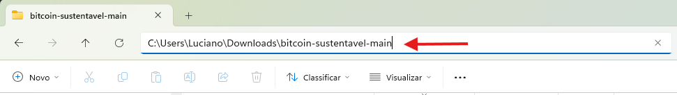
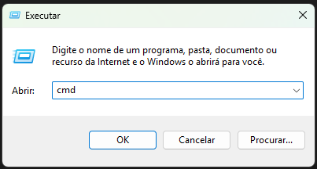

# Bitcoin Sustentável #


---

# Apresentação do Projeto

O projeto tem como objetivo busca uma alternativa com placas solares para reduzir o impacto ambiental da mineração de Bitcoin, propondo uma solução sustentável e viável com o uso de energia solar.

A iniciativa avalia se é possível manter uma estação de mineração apenas com energia limpa e em quanto tempo o investimento se pagaria.

***Questões norteadoras:***
- É possível manter uma mineração de Bitcoin apenas com energia solar?
- Em quanto tempo o investimento inicial se pagaria?

O sistema permite ao usuário simular cenários com base no orçamento, local de instalação e custo da energia, calculando a potência necessária, o custo da estrutura solar e a rentabilidade do projeto.

---

# Tecnologias Utilizadas
- **Backend:** Python 3.8+, Flask 2.3.3
- **Frontend:** HTML5, CSS3, JavaScript
- **Arquitetura:** Aplicação web com backend Flask e frontend estático

---

# Estrutura do Projeto:

```
bitcoin-sustentavel/
├── app.py                # Aplicação Flask principal
├── calculadora.py        # Módulo de cálculos de viabilidade
├── requirements.txt      # Dependências do Python
├── templates/            # Templates HTML
│   └── index.html
├── static/               # Arquivos estáticos
│   ├── css/
│   ├── js/
│   └── imgs/
└── README.md             # Este arquivo
```

---

# Como Executar o Projeto

## Pré-requisitos
- Python 3.8 ou superior instalado

## Passo a Passo

1. Download do projeto
   - Faça o download do projeto como arquivo ZIP, por meio do link abaixo.
   - https://github.com/lucianojcosta/bitcoin-sustentavel/archive/refs/heads/main.zip
   - Após o download, extraia os arquivos para uma pasta local

2. Navegue até a pasta do projeto
   - Verifique o caminho da pasta, conforme print abaixo.
   - 
   - Copie esse caminho

3. Executar o Prompt de Comando
   - Clique Windows + R
   - E digite "cmd" e pressione Enter, conforme print abaixo.
   - 

4. No terminal, digitar:
   ```bash
   cd "LOCAL_DA_PASTA_COPIADA_ANTERIORMENTE"
   ```
   Exemplo:
   ```bash
   cd "C:\Users\Luciano\Downloads\bitcoin-sustentavel-main"
   ```

5. Instalar o Flask. No terminal, digitar:
   ```bash
   pip install -r requirements.txt
   ```

6. Executar a aplicação. No terminal, digitar:
   ```bash
   python app.py
   ```

7. No navegador, acessar a página:
   ```
   http://127.0.0.1:5000/
   ```
---

# Alunos Participantes

1. **Antenor Bento da Silva Neto** – 252033425
2. **Eduardo Maia de Oliveira** – 252038664
3. **Hilber Pereira Barbosa Silva** – 252038717
4. **Luciano José Rocha Costa** – 252026627

---
